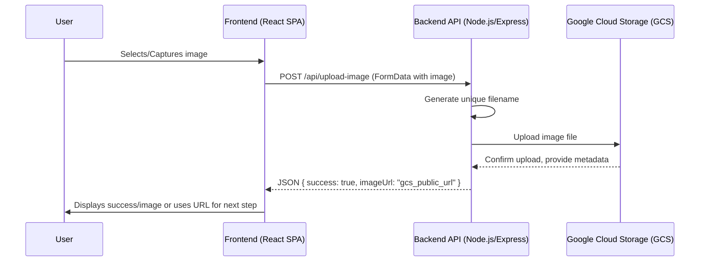

# System Patterns: Snap2Cash

## Overall Architecture
*   **Client-Server Model:** The application follows a classic client-server architecture.
    *   **Client (Frontend):** A React-based Single Page Application (SPA) running in the user's browser. Responsible for UI, user interaction, and initiating API requests.
    *   **Server (Backend):** A Node.js/Express application responsible for business logic, data processing (like image uploads), and integration with external services (like GCS).

## Key System Components & Interactions (Focus on Image Upload)

## Design Patterns (Planned for Backend)

*   **RESTful API:** The backend will expose a RESTful API endpoint (`POST /api/upload-image`) for image uploads.
*   **Middleware (Express):**
    *   `cors`: For handling cross-origin requests.
    *   `multer`: For parsing `multipart/form-data` and handling file uploads.
    *   Error handling middleware: For centralized error management and consistent JSON error responses.
*   **Service/Utility Layer:** The GCS upload logic will be encapsulated in a dedicated utility module (`server/utils/gcsUploader.ts`) to promote separation of concerns and reusability.
*   **Environment Configuration:** Using `.env` files and `dotenv` library to manage environment-specific configurations (e.g., GCS bucket name, API keys).

## Data Flow (Image Upload)

1.  **Input:** Image file (e.g., JPEG, PNG) from the user via the frontend.
2.  **Transmission:** Sent as `multipart/form-data` in a POST request to the backend.
3.  **Processing (Backend):**
    *   Received by Express server.
    *   `multer` middleware extracts the file.
    *   A unique filename is generated (e.g., using `uuid` + original extension).
    *   The `gcsUploader` utility uploads the file stream/buffer to the specified GCS bucket.
4.  **Storage:** The image is stored in the GCS bucket (`snap2cash-uploads`).
5.  **Output:** A public URL pointing to the uploaded image in GCS is returned to the frontend.

## Critical Implementation Paths

*   **GCS Authentication:** Securely handling the `service-account.json` key for GCS client library initialization.
*   **File Handling:** Efficiently streaming/buffering the uploaded file to GCS without excessive memory consumption on the server.
*   **CORS Configuration:** Ensuring the frontend (potentially running on `localhost:xxxx`) can communicate with the backend (e.g., `localhost:yyyy`).
*   **Error Handling:** Gracefully handling potential errors during file upload (e.g., GCS errors, invalid file types, network issues) and returning appropriate responses to the client.
